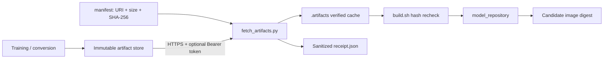

# 외부 모델 Artifact 파이프라인

이 문서는 Git에 넣지 않는 ONNX, TensorRT plan, FIL, LLM weight를 검증된
`model_repository`로 옮기는 계약을 설명합니다. 목표는 URL에서 파일을 받았다는 사실이 아니라
**승인된 source revision이 지정한 byte만 serving image에 포함됐음**을 증명하는 것입니다.

## 구조



## Manifest 계약

외부 artifact 모델을 활성화하려면 `artifact: external`, `required_files`, `artifacts`를 함께
선언합니다. 여러 weight나 label 파일이 필요하면 항목을 각각 추가합니다.

```yaml
- source: vision/classification/resnet50
  target: resnet50
  tags: [gpu, onnx, vision]
  environments: [staging, prod]
  enabled: true
  artifact: external
  required_files: ["1/model.onnx"]
  artifacts:
    - path: "1/model.onnx"
      uri: "https://models.example.com/resnet50/2026-09-01/model.onnx"
      sha256: "0123456789abcdef0123456789abcdef0123456789abcdef0123456789abcdef"
      size_bytes: 1024000
      auth_token_env: MODEL_ARTIFACT_TOKEN
```

| 필드 | 계약 |
|------|------|
| `path` | model directory 기준 정규화된 상대 경로. 절대 경로와 `..` 금지 |
| `uri` | 기본적으로 HTTPS만 허용. immutable object/version URL 사용 |
| `sha256` | 정확히 64자리 소문자 SHA-256 |
| `size_bytes` | 다운로드 전후에 확인할 정확한 양의 정수 크기 |
| `auth_token_env` | 선택적 Bearer token 환경변수 이름. token 값은 manifest에 기록하지 않음 |

`artifacts[].path` 집합은 `required_files`와 정확히 같아야 합니다. URI에 만료되는 서명 query나
credential을 commit하지 말고 고정 object URL과 CI Secret의 token을 사용합니다. TensorRT
plan은 build한 TensorRT 버전과 target GPU architecture도 모델 변경 기록에 남기고 SKU가 다르면
artifact와 성능 기준선을 분리합니다.

## 게시와 검증 시나리오

1. 신뢰된 converter 환경에서 모델을 만들고 형식 검증과 golden inference를 통과시킵니다.
2. 덮어쓸 수 없는 revision 경로에 게시합니다. 동일 key를 갱신하지 않습니다.
3. 게시한 byte의 크기와 SHA-256을 계산해 manifest에 기록합니다.
4. GitHub repository Variable `ARTIFACT_ALLOWED_HOSTS`에 쉼표로 구분한 정확한 host를 등록합니다.
5. private 저장소라면 `MODEL_ARTIFACT_TOKEN` Secret에 read-only token을 등록합니다.
6. candidate CI가 artifact를 내려받아 검증하고 `.artifacts/receipt.json`을 90일간 보존합니다.
7. `build.sh`가 cache의 크기와 hash를 다시 확인한 뒤 임시 repository를 원자적으로 게시합니다.

S3/GCS/Azure를 사용할 때는 이 스크립트에 장기 cloud key를 넣기보다 workload identity로 접근하는
내부 HTTPS artifact gateway 또는 짧은 수명의 read-only token을 사용합니다. Redirect 목적지도
모두 allowlist에 있어야 하며 인증 요청은 다른 host로 redirect하지 않습니다.

## 실행

운영과 같은 원격 검증:

```bash
export ARTIFACT_ALLOWED_HOSTS=models.example.com
export MODEL_ARTIFACT_TOKEN='<read-only-token>'
python scripts/fetch_artifacts.py --env prod --output-dir .artifacts
./scripts/build.sh --env prod --artifact-root .artifacts --clean
```

로컬 fixture 검증은 명시한 root 아래 `file://`만 허용합니다. production CI에서는
`--local-root`를 사용하지 않습니다.

```bash
python scripts/fetch_artifacts.py \
  --manifest /tmp/test-manifest.yaml \
  --output-dir /tmp/test-artifacts \
  --local-root /tmp/model-fixtures
```

단일 artifact 기본 상한은 50GiB, 선택된 전체 상한은 200GiB입니다. 더 큰 모델은
`--max-artifact-bytes`, `--max-total-bytes`를 명시적으로 조정하고 runner disk와 registry layer
크기를 함께 검토합니다.

## 실패 의미와 증거

- scheme, host, redirect, 경로, 크기, SHA-256 중 하나라도 다르면 전체 fetch가 실패합니다.
- 다운로드 중 실패하면 기존 `.artifacts` cache를 유지하며 부분 파일을 게시하지 않습니다.
- `build.sh`에서도 cache를 다시 검증하므로 fetch 이후 변조된 파일은 release에 포함되지 않습니다.
- receipt에는 token과 URI query를 기록하지 않고 target, path, 정제된 URI, 크기, SHA-256만 남깁니다.
- archive를 자동 해제하지 않습니다. archive traversal과 압축 폭탄 위험을 피하기 위해 필요한
  runtime 파일을 개별 artifact로 게시하거나 검증된 converter image에서 model directory를 만듭니다.

외부 artifact를 사용하는 release의 승인 증거에는 source SHA, candidate image digest,
`receipt.json`, golden inference와 target GPU 성능 결과가 같은 revision을 가리켜야 합니다.
