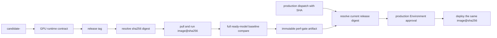

# 정확한 Release Digest 성능 Gate

이 문서는 성능 측정 결과를 production에 배포할 실제 container byte와 연결하는 절차를
설명합니다. 같은 commit에서 이미지를 다시 build했다는 사실만으로는 registry의 release
image와 동일하다고 증명할 수 없습니다. build 시점, base image, 외부 artifact 또는 build
환경이 달라질 수 있으므로 gate의 기준은 commit SHA가 아니라 최종 registry digest입니다.

## 전체 흐름



## Gate identity

다음 값이 모두 같아야 production preflight가 통과합니다.

| 항목 | 검증 기준 |
|------|-----------|
| source | `origin/main`에 포함된 40자리 release SHA |
| image | `ghcr.io/<owner>/<repo>@sha256:<64-hex>` |
| benchmark scope | `all-ready-models`; 단일 모델 진단 실행은 제외 |
| workload | 해당 release SHA의 `baseline.json`, `profiles.json` SHA-256 |
| result | 각 `*_perf.csv`의 파일명, 크기, SHA-256 |
| producer | main에서 수동 실행된 성공 상태의 `perf-benchmark.yml` run·attempt·workflow SHA |
| runner | runner 이름과 `nvidia-smi`의 GPU model·driver 기록 |

artifact 이름에도 source와 digest를 함께 넣습니다.

```text
perf-gate-<40-char-source-SHA>-<64-char-image-digest>
```

release tag가 나중에 다른 digest를 가리키면 기존 artifact 이름과 일치하지 않으므로 재사용할
수 없습니다. baseline, profile 또는 CSV byte가 달라져도 evidence 내부 hash 검증에서
실패합니다.

## 실행 순서

1. main revision의 `CI - Build Candidate`가 candidate image를 게시합니다.
2. 같은 revision에서 `CI - GPU Release`를 실행해 runtime contract를 통과한 digest에 SHA
   release tag를 붙입니다.
3. `Performance Benchmark`를 **main branch에서** 수동 실행합니다.
4. `release_sha`에는 40자리 SHA를 입력하고, production gate를 만들 때 `model`은 비웁니다.
5. workflow가 SHA release tag를 digest로 해석하고 `docker pull image@sha256:...`와
   `docker run image@sha256:...`를 수행합니다. model control, thread count, cache와 rate limiter
   인자는 production Kustomize overlay와 같게 적용합니다.
6. 모든 ready 모델의 perf 결과가 baseline을 통과하면 evidence JSON과 CSV를 90일 보존합니다.
7. main branch에서 `CD - Production`에 같은 SHA를 입력합니다. preflight가 현재 release digest와 정확히
   일치하는 evidence를 찾고 검증한 뒤에만 Environment 승인 단계가 열립니다.

현재 GPU runner가 없다면 3~6단계를 실행할 수 없으며 신규 production 배포는 의도적으로
차단됩니다. 이 경우 gate를 우회하지 말고 GPU runner를 준비하거나, 별도 변경관리 절차로
정책 자체를 명시적으로 변경해야 합니다. `rollback=true`는 이미 배포된 직전 revision을
복구하는 긴급 경로이므로 새 성능 evidence를 요구하지 않습니다.

## Evidence 내용

`tests/perf/release_evidence.py`가 다음 자료를 생성하고 같은 도구가 production에서 다시
검증합니다.

```json
{
  "schema_version": 1,
  "status": "passed",
  "source_revision": "<40-char-sha>",
  "image": {
    "ref": "ghcr.io/example/project@sha256:<digest>",
    "digest": "sha256:<digest>"
  },
  "benchmark": {
    "scope": "all-ready-models",
    "baseline_sha256": "<sha256>",
    "profiles_sha256": "<sha256>",
    "results": [
      {
        "model": "text_classifier",
        "file": "text_classifier_perf.csv",
        "size_bytes": 123,
        "sha256": "<sha256>"
      }
    ]
  },
  "runner": {
    "name": "gpu-runner-1",
    "gpu_inventory": ["NVIDIA A100, 550.54.15"]
  },
  "github": {
    "repository": "example/project",
    "workflow_file": ".github/workflows/perf-benchmark.yml",
    "workflow_revision": "<40-char-workflow-sha>",
    "run_id": 12345,
    "run_attempt": 1
  }
}
```

Production preflight는 이름만 믿지 않습니다. GitHub API로 artifact를 만든 run이 완료·성공
상태인지, event가 `workflow_dispatch`인지, workflow path가
`.github/workflows/perf-benchmark.yml`인지, branch와 repository가 맞는지 확인합니다. 이어서
evidence의 source, image ref/digest, workflow run ID·attempt·workflow revision,
baseline/profile hash와 모든 CSV hash를
재검증합니다.

## 진단 실행과 Gate 실행

| 입력 | 용도 | production gate artifact |
|------|------|--------------------------|
| `model` 비움 | release 전체 ready 모델 검증 | 생성 |
| `model=text_classifier` 등 | 특정 모델 튜닝·원인 분석 | 생성하지 않음 |

단일 모델 결과는 문제 분석에는 유용하지만 다른 ready 모델의 성능을 증명하지 않으므로 배포
승인에 사용할 수 없습니다. 전체 실행에서도 profile 없는 ready 모델, baseline 없는 결과,
비정상 수치, 누락된 CSV가 있으면 evidence 생성 전에 workflow가 실패합니다.

## 실패 해석

| 실패 | 의미 | 조치 |
|------|------|------|
| release tag 없음 | GPU runtime 승격 전이거나 잘못된 SHA | `CI - GPU Release` 결과 확인 |
| digest artifact 없음 | 해당 image byte의 전체 perf 미실행 | `Performance Benchmark` 전체 실행 |
| trusted run 불일치 | 다른 workflow/branch 또는 실패 run의 artifact | 공식 workflow를 main에서 재실행 |
| baseline/profile hash 불일치 | 측정 후 workload 계약이 달라짐 | 현재 release SHA 기준으로 재측정 |
| CSV hash 불일치 | artifact 내용과 evidence 불일치 | artifact 폐기 후 재실행 |
| evidence 만료 | 보존 기간 90일 경과 | 같은 digest를 다시 benchmark |

GPU inventory는 감사와 재현성 확인을 위한 증거이며, 현재 스크립트가 GPU SKU 자체를 자동
허용/차단하지는 않습니다. 실제 production 전에는 dedicated runner의 GPU model과 driver를
`baseline.json`의 측정 조건에 맞추고, branch protection과 CODEOWNERS로 perf workflow와
evidence 검증 도구 변경을 보호해야 합니다. 이 Docker benchmark는 image와 Triton runtime
계약의 회귀 gate이며 Kubernetes CPU/memory limit, network hop, multi-replica routing과
noisy-neighbor 영향까지 재현하지는 않습니다. 그 차이는 staging traffic replay와 배포 후 SLO
관찰로 별도 확인합니다.
