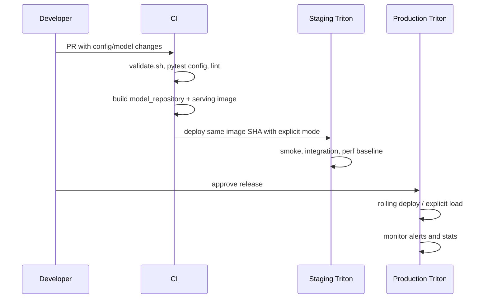

# Production 도입 가이드

이 문서는 이 저장소를 실제 production serving에 도입할 때의 결정 순서와 운영 기준을
정리합니다. 모든 팀이 처음부터 전체 구성을 쓸 필요는 없습니다. 아래 maturity 단계를
하나씩 통과하면서 적용 범위를 넓히는 방식을 권장합니다.

## Maturity 단계

| 단계 | 목표 | 완료 기준 |
|------|------|-----------|
| 0. Sandbox | Triton과 모델 config 이해 | 로컬 Docker에서 단일 모델 load, health check 성공 |
| 1. Staging | 배포 절차 검증 | `explicit` 모드, smoke/integration test, metrics 수집 |
| 2. Production single service | 한 서비스의 안정 운영 | rollback, alert, SLO, model artifact 이력 확보 |
| 3. Shared platform | 여러 팀/모델 공용화 | manifest 표준, quota/rate limit, ownership, runbook |

## 도입 전 질문

1. 모델 traffic은 online 요청인가, batch/비동기 요청인가?
2. latency SLO와 throughput 목표는 무엇인가?
3. 모델 입력 shape은 고정인가, 가변인가?
4. 같은 입력이 반복되어 response cache가 의미 있는가?
5. 모델 업데이트는 하루 몇 번 일어나는가?
6. GPU 한 장에 여러 모델을 같이 올릴 것인가?
7. 장애 시 모델을 내릴지, 이전 버전으로 되돌릴지, traffic을 우회할지 정했는가?

이 질문에 답하지 못하면 먼저 staging에서 traffic replay와 perf analyzer를 돌리는 편이
좋습니다.

## 권장 production 설정

| 영역 | 권장값 | 이유 |
|------|--------|------|
| model control | `explicit` + 승인된 초기 모델 목록 | 시작 시 무모델 상태를 피하고 운영 중 변경은 API로 제한 |
| repository | 기본은 image-bundled, 대형 모델은 별도 immutable revision | 배포 단위와 rollback 대상 명확화 |
| cache | `--cache-config=local,size=...`부터 검증 | 기본 구현으로 효과 확인 후 확장 |
| rate limiter | GPU memory가 빡빡한 모델부터 적용 | OOM과 cross-model 간섭 완화 |
| logging | `--log-verbose=0` | 정상 traffic에서 로그 비용 최소화 |
| metrics | `--allow-metrics=true`, `--allow-gpu-metrics=true` | Prometheus 기반 운영 관측 |
| probes | live/ready 분리 | 시작 지연과 실제 장애를 분리 |
| replicas | 최소 2개 이상 | rolling update와 node 장애 대응 |
| PDB | prod에서 활성화 | voluntary disruption 중 가용성 보호 |
| image tag | digest 또는 명시 버전 | 재배포 시 다른 이미지가 내려오는 사고 방지 |

## 배포 흐름



Production workflow의 `image_tag`에는 `main`에 포함된 40자리 commit SHA만 넣습니다. workflow는
그 SHA의 image뿐 아니라 같은 SHA의 Kustomize manifest와 smoke test를 checkout합니다. 승인
화면에는 image SHA, model manifest revision, config 변경을 하나의 release 단위로 표시하고,
branch 밖 commit이나 mutable tag는 production 입력으로 허용하지 않습니다.

기본 pipeline은 model repository를 serving image에 포함하므로 image SHA 하나가 runtime과 모델
세트를 함께 식별합니다. 대형 모델을 object storage/PVC로 분리하면 model revision과 checksum을
release metadata에 추가하고, staging에서 검증한 바로 그 revision만 production이 읽게 해야
합니다. `latest` 경로나 운영 중 덮어쓰는 공유 디렉토리는 rollback 단위로 사용하지 않습니다.

## Release checklist

배포 전:

- `config.pbtxt`의 `name`, `backend/platform`, input/output, `max_batch_size` 확인
- 모델 바이너리 파일명과 backend 기대 파일명 확인 (`model.onnx`, `model.plan`, `model.py` 등)
- `model_warmup` 입력 shape와 실제 입력 shape 일치 확인
- `response_cache`를 켠 모델은 deterministic output인지 확인
- `instance_group` count와 GPU memory 사용량 확인
- `scripts/build.sh --env staging --clean` 결과물 확인
- staging에서 Repository Index API, `/ready`, `/stats`, `/metrics` 확인
- perf baseline 대비 latency/throughput 악화 여부 확인

성능 기준선은 동일한 GPU 종류, Triton image, 모델 artifact, 입력 데이터, concurrency에서
측정해야 합니다. `tests/perf/baseline.json`의 예시 숫자를 그대로 SLO로 사용하지 말고,
전용 runner에서 여러 차례 측정한 안정 구간의 하한(throughput)과 상한(p95 latency)으로
교체합니다. `tests/perf/compare_baseline.py`는 `perf_analyzer` CSV를 읽어 이 기준을 실제로
위반하면 실패 코드를 반환합니다.

기본 Triton Prometheus 지연 metric은 histogram이 아니라 누적 counter입니다. 따라서
Grafana의 운영 대시보드는 `rate(duration_us) / rate(success_count)`로 평균 지연을 표시하고,
p95/p99는 `perf_analyzer` 또는 trace backend에서 확인합니다. 요청량이 적어도 error ratio가
왜곡되지 않도록 alert 분모를 임의의 `1`로 올리지 않습니다.

배포 후:

- 5분 동안 error rate, average latency, queue time, GPU memory 확인
- 새 모델 version이 의도대로 선택되는지 확인
- cache hit/miss가 예상 범위인지 확인
- client timeout/retry 로그 증가 여부 확인

Rollback 기준:

- error rate가 SLO를 2회 연속 초과
- queue time이 지속 증가하고 scale-out으로 회복되지 않음
- GPU OOM 또는 model unavailable 발생
- 응답 schema가 이전 contract와 달라 downstream 장애 발생

## 운영 시 자주 하는 실수

| 실수 | 증상 | 예방 |
|------|------|------|
| prod에서 `poll` 사용 | 미완성 파일을 읽고 model unavailable | prod는 `explicit`만 사용 |
| 모델 바이너리 없이 config만 배포 | server ready 실패, model unavailable | artifact 존재 검사 추가 |
| dynamic batching만 켜고 traffic이 낮음 | latency만 늘고 throughput 효과 없음 | queue delay와 request concurrency 함께 튜닝 |
| cache를 비결정 모델에 적용 | 오래된/부정확한 응답 | deterministic 모델만 cache |
| Python backend에 무거운 전처리 집중 | CPU 병목, queue 증가 | 전처리 최적화 또는 별도 scale |
| alert가 없는 metric을 참조 | 경보 미발생 | 실제 `/metrics` 출력 기준으로 rule 작성 |

## 운영 인수 파일의 역할

`configs/*.txt`는 "왜 이 값을 쓰는지"를 남기는 운영 메모입니다. Helm/Kustomize/Docker
설정과 1:1로 완전히 자동 합성되지는 않지만, 값 변경 시 함께 갱신해야 하는 기준 문서로
사용합니다.

환경별 실제 실행 인자는 다음 위치에 있습니다.

- Docker dev: `deploy/docker/docker-compose.yml`
- Docker prod: `deploy/docker/docker-compose.prod.yml`
- Helm: `deploy/helm/triton/values*.yaml`
- Kustomize base: `deploy/k8s/base/deployment.yaml`
- Kustomize overlay: `deploy/k8s/overlays/*/triton_args_patch.yaml`

Docker Compose production 예시는 단일 호스트 검증용이며 기본적으로 모든 포트를
`127.0.0.1`에만 바인딩합니다. 외부 공개는 인증·TLS·rate limit을 적용한 reverse proxy를
통해 수행하고, `.env.prod`의 `GRAFANA_ADMIN_PASSWORD`를 채우기 전에는 기동하지 않습니다.
`.env.prod`와 `.env.staging`은 secret이 들어갈 수 있으므로 Git에 추적하지 않습니다.

production Compose의 `TRITON_IMAGE`에는 CI가 `model_repository`를 포함해 만든 commit SHA tag
또는 digest만 지정합니다. 이 파일은 host의 가변 `model_repository`를 mount하지 않습니다.
단일 호스트에서 release 후보를 재현할 때도 아래처럼 image와 모델 세트를 같은 단위로
검증합니다.

```bash
./scripts/build.sh --env prod --clean
docker build -f deploy/docker/Dockerfile \
  --build-arg VCS_REF="$(git rev-parse HEAD)" \
  -t "triton-server:$(git rev-parse HEAD)" .
TRITON_IMAGE="triton-server:$(git rev-parse HEAD)" \
GRAFANA_ADMIN_PASSWORD='<secret>' \
docker compose -f deploy/docker/docker-compose.prod.yml up -d
```

Kubernetes에서도 Triton의 8000/8001 port를 그대로 인터넷에 노출하지 않습니다. Ingress/API
gateway에서 사용자 인증을 적용하고, repository load/unload API는 배포 identity만 접근할 수
있게 경로 또는 별도 내부 gateway로 분리합니다. 제공하는 prod Kustomize 예시는 TLS와 basic
auth를 최소선으로 두며, 조직의 OIDC 또는 mTLS 정책으로 교체하는 것을 권장합니다.

## 참고 문서

- Model Management: https://docs.nvidia.com/deeplearning/triton-inference-server/user-guide/docs/user_guide/model_management.html
- Rate Limiter: https://docs.nvidia.com/deeplearning/triton-inference-server/user-guide/docs/user_guide/rate_limiter.html
- Response Cache: https://docs.nvidia.com/deeplearning/triton-inference-server/user-guide/docs/user_guide/response_cache.html
- Performance Tuning: https://docs.nvidia.com/deeplearning/triton-inference-server/user-guide/docs/user_guide/performance_tuning.html
