# Production Release Evidence

이 문서는 Triton release 승인자가 감이 아니라 재현 가능한 증거로 배포 여부를 결정하도록
release identity, 단계별 gate, 실패 시 복구 범위를 한곳에 정리합니다. 설정의 이유는
[아키텍처](architecture.md), 도입 순서는 [Production 도입 가이드](production-adoption.md),
장애 중 명령은 [Runbook](runbook.md)을 함께 봅니다.

## Release identity

한 release는 다음 값을 함께 식별해야 합니다.

| 항목 | 이 저장소의 기본값 | 증거 |
|------|-------------------|------|
| source revision | `main`에 포함된 40자리 commit SHA | `git merge-base --is-ancestor` 성공 |
| serving image | `ghcr.io/...@sha256:<digest>` | registry digest와 Pod `imageID` 일치 |
| model set | image에 포함된 production `model_repository` | build log와 필수 모델 inference |
| deployment config | 같은 SHA의 prod Kustomize overlay | workflow checkout SHA와 render 결과 |
| environment | 승인된 kube context와 `production` namespace | context 검증 log |

commit SHA는 source와 manifest를 선택하는 값이고 image digest는 실제 배포 byte를 식별하는
값입니다. 둘을 같은 값처럼 기록하지 않습니다. 외부 PVC/object storage를 쓰면 model revision과
checksum을 별도 필수 identity로 추가합니다.

```mermaid
flowchart LR
    pr["PR validation"] --> candidate["Candidate image digest"]
    candidate --> contract["Manual GPU runtime contract tests"]
    contract --> release["SHA release tag"]
    release --> staging["Staging rollout and integration"]
    staging --> approval["Production approval"]
    approval --> prod["Production digest rollout"]
    prod --> evidence["Pod, model, cache evidence"]
    evidence --> observe["Metrics observation"]
```



## 역할과 승인 경계

| 역할 | 책임 | 단독으로 생략할 수 없는 것 |
|------|------|---------------------------|
| 변경 작성자 | config/model/test 변경, 영향과 rollback 단위 기록 | PR validation |
| release 승인자 | staging·성능 증거와 identity 대조, go/no-go 결정 | production Environment 승인 |
| platform 운영자 | registry, cluster, NetworkPolicy, 관측성 상태 확인 | kube context와 runtime digest 검증 |
| 당직자 | 영향 완화, 증거 보존, 복구 판정 | Runbook의 복구 완료 조건 |

소규모 팀에서 한 사람이 여러 역할을 맡아도 증거와 승인 경계는 합치지 않습니다. 긴급 배포는
검증을 삭제하는 절차가 아니라 승인 시간을 줄이고 사후 review 기한을 명시하는 절차입니다.

## 표준 release 시나리오

1. PR에서 unit/config/Markdown, Kustomize, Helm, Compose, Prometheus rule을 검증합니다.
2. main CI는 production 모델 세트를 한 번 build해 candidate digest를 만듭니다.
3. GPU runner가 준비된 시점에 수동 release workflow가 candidate container를 production runtime
   flag로 실행해 health, 필수 모델 output, cache miss/hit를 검증한 뒤에만 commit SHA tag를
   같은 digest에 붙입니다.
4. staging은 그 digest를 배포하고 전체 integration suite를 실행합니다. 실패하면 직전 image를
   복원하되 image 외 manifest 변경은 이전 GitOps revision으로 별도 복원합니다.
5. 승인자는 같은 SHA의 perf 결과와 아래 go/no-go 항목을 확인합니다.
6. production은 Deployment 선언 image와 모든 Triton Pod의 runtime digest를 대조한 뒤 health,
   필수 모델 output, cache counter를 다시 검증합니다.
7. 배포 뒤 최소 5분간 error rate, 평균 latency, queue time, GPU memory를 관찰합니다. 조직 SLO가
   더 긴 window를 요구하면 그 시간을 우선합니다.

## 단계별 필수 증거

| 단계 | 성공 증거 | 실패 시 상태 |
|------|-----------|-------------|
| PR | `ci-validate` 전체 성공 | merge 금지 |
| candidate | production 모델 세트를 포함한 image digest 기록 | candidate만 유지, 배포 금지 |
| GPU release | runtime contract test 성공, candidate/release digest 동일 | SHA release tag 미생성 |
| staging | rollout, readiness, integration 성공 | 직전 image 복원 또는 최초 배포 실패 명시 |
| approval | 동일 SHA perf artifact, 변경·rollback 단위 확인 | production 실행 보류 |
| production | Deployment image와 Pod `imageID` 일치, 필수 모델/cache gate 성공 | Deployment 자동 rollback |
| post-deploy | critical alert 없음, SLO signal 정상 | traffic 완화 후 전체 release 복원 |

CI log 보존 기간이 incident 분석 기간보다 짧다면 digest, test summary, 승인자, 배포 시각을
release issue나 변경관리 시스템에 옮깁니다. kubeconfig, token, 고객 payload는 증거에 포함하지
않습니다.

## Go / No-go

다음 항목을 모두 만족할 때만 승인합니다.

- 요청 SHA가 `origin/main`에 포함되고 GPU 검증을 거친 candidate와 release tag의 registry digest가 같다.
- staging Deployment와 Pod가 같은 digest를 실행하며 integration test가 통과했다.
- 필수 모델의 name, version, input/output dtype·shape가 client contract와 일치한다.
- 같은 image SHA의 성능 결과가 합의한 throughput 하한과 p95 latency 상한을 만족한다.
- GPU 종류, replica, HPA/PDB, NetworkPolicy와 model repository 방식이 승인 내용과 같다.
- rollback할 이전 정상 SHA와 담당자가 정해져 있고 외부 model revision도 복원 가능하다.
- 배포 시간대의 당직자와 관찰 window가 확보됐다.

하나라도 확인할 수 없으면 `no-go`입니다. “staging에서 대체로 동작함”이나 mutable `latest` tag는
승인 증거가 아닙니다.

## 실패 시나리오

### Staging 검증 실패

workflow가 기록한 직전 immutable image로 복구됐는지 rollout 결과를 확인합니다. ConfigMap,
Ingress, NetworkPolicy처럼 image 밖 변경이 있었다면 실패 SHA의 manifest가 남을 수 있으므로
이전 정상 SHA를 다시 적용합니다. 최초 배포에는 자동 복구 대상이 없습니다.

### Production 검증 실패

자동 rollback은 직전 ReplicaSet의 Deployment image만 되돌립니다. 서비스가 회복되더라도
Ingress, HPA, PDB, NetworkPolicy, Secret, 외부 model revision은 그대로일 수 있습니다. 영향이
안정되면 이전 정상 SHA로 production workflow를 `rollback=false` 실행해 전체 release 상태를
다시 일치시킵니다.

### 외부 model repository 실패

image와 model revision을 독립적으로 추적했다면 두 identity를 모두 이전 값으로 복구합니다.
파일을 덮어쓰지 말고 검증된 immutable revision을 원자적으로 전환한 뒤 checksum, repository
index, 필수 inference를 다시 확인합니다.

## 변경 기록 예시

```text
source_sha: <40-char main SHA>
image_digest: sha256:<64-hex>
model_revision: image-bundled | <external revision + checksum>
staging_run: <workflow URL>
perf_artifact: <artifact URL and profile>
approved_by: <name>
deployed_at: <UTC timestamp>
observation_result: <SLO signals and alert state>
rollback_release: <previous healthy SHA>
```

문제가 발생하면 이 기록을 incident timeline의 시작점으로 사용하고, 최종 복구 판정은
[Runbook의 복구 확인](runbook.md#복구-확인)을 따릅니다.
