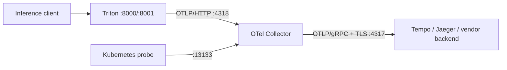

# OpenTelemetry Collector 운영 가이드

이 디렉토리는 Triton이 생성한 OTLP/HTTP trace를 Collector가 받아 조직의 trace
backend로 전달하는 경계를 정의합니다. 기본 Compose와 Kubernetes overlay에는 Collector가
포함되지 않으므로, 조직의 observability namespace에 별도로 배포한 뒤 opt-in으로 연결합니다.

## 시나리오와 구조



- Triton과 Collector가 같은 신뢰 경계에 있을 때만 내부 구간의 평문 OTLP/HTTP를 허용합니다.
- Collector Service는 `ClusterIP`로 두고 public Ingress나 `LoadBalancer`로 노출하지 않습니다.
- NetworkPolicy는 Triton Pod에서 Collector `4318`로 가는 트래픽만 허용합니다. production
  overlay의 기본 egress는 deny-all이므로 실제 연결 전 이 규칙을 명시적으로 추가해야 합니다.
- Collector에서 backend로 나가는 구간은 TLS 인증서와 hostname을 검증합니다.

## 설정 선택

| 파일 | 용도 | 보안 기본값 |
|------|------|-------------|
| `otel-collector-config.yaml` | staging/production | backend 주소 필수, TLS 검증, bounded batch, retry queue |
| `otel-collector-config.dev.yaml` | 로컬 Jaeger 디버깅 | 평문 전송과 `debug` exporter 허용 |

운영 설정에는 `debug` exporter를 넣지 않습니다. trace attribute에는 요청 식별자나 모델
메타데이터가 포함될 수 있고, 요청량에 비례해 Collector 로그 비용도 커지기 때문입니다.
또한 Triton이 사용하는 OTLP/HTTP receiver만 열어 불필요한 inbound gRPC port를 제거합니다.

## 운영 적용

1. Collector Deployment에 backend 주소를 주입합니다. 값은 URL이 아닌 `host:port` 형식이며,
   서버 인증서의 SAN과 일치해야 합니다.

   ```yaml
   env:
     - name: OTEL_EXPORTER_OTLP_ENDPOINT
       value: tempo-gateway.observability.svc.cluster.local:4317
   ```

2. 사설 CA를 사용하면 CA 파일을 Secret/ConfigMap volume으로 read-only mount하고 운영 설정의
   `exporters.otlp/backend.tls`에 `ca_file: /etc/otel/certs/ca.pem`을 추가합니다. 인증 토큰은
   저장소에 쓰지 말고 Collector가 지원하는 인증 extension과 Kubernetes Secret으로 전달합니다.
3. Triton Deployment에 `configs/tracing/otel.txt`의 인수를 반영하고
   `OTEL_COLLECTOR_URL`을 `http://otel-collector.observability.svc.cluster.local:4318/v1/traces`
   같은 내부 주소로 렌더링합니다.
4. `rate=100`은 100개 요청당 1개를 trace하는 시작값입니다. 장애 분석에 필요한 표본 수와
   Collector/backend 비용을 함께 측정해 조정하며, 입력 tensor 자체를 attribute로 추가하지 않습니다.

Collector 이미지 버전을 고정한 뒤 배포 전에 해당 버전의 binary로 실제 component schema를
검증합니다. 환경 변수도 검증 명령에 함께 전달해야 합니다.

```bash
OTEL_EXPORTER_OTLP_ENDPOINT=tempo.example.internal:4317 \
  otelcol-contrib validate --config=monitoring/otel/otel-collector-config.yaml
```

## 배포 확인과 장애 대응

1. Collector 시작 로그에 config decode 또는 TLS 오류가 없는지 확인합니다.
2. `:13133` health endpoint가 준비 상태를 반환하는지 확인합니다.
3. 테스트 inference 한 건을 보내고 sampling 대상 trace가 backend에서
   `service.name=triton-inference-server`로 조회되는지 확인합니다.
4. backend 장애를 재현해 retry와 queue가 동작하는지, 5분 뒤에는 무한 적재 대신 drop되는지
   Collector의 exporter 실패·queue·drop metrics로 확인합니다.
5. 메모리 사용량이 limiter에 반복 도달하면 단순히 limit만 높이지 말고 trace rate, backend
   처리량, queue 크기를 함께 조정합니다.

기본 queue는 메모리 기반이므로 Collector 재시작 때 대기 중인 trace는 유실될 수 있습니다.
trace 보존이 반드시 필요한 환경만 `file_storage` extension과 전용 PVC를 검토하고, 디스크
고갈·종료 시 flush·복구 절차를 장애 훈련에서 별도로 검증합니다.

운영에서 trace가 보이지 않을 때는 Triton 인수 반영 여부, Pod에서 `:4318` 연결 가능 여부,
Collector exporter 오류, backend 수신 순서로 확인합니다. 민감하지 않은 로컬 데이터로 원인을
재현할 때만 개발 설정의 `debug` exporter를 사용합니다.
